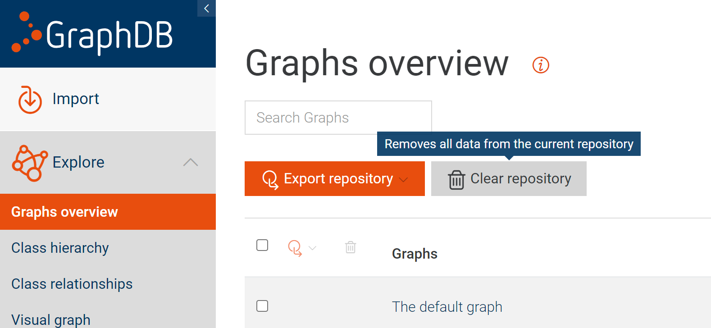

## Common error messages
### Cannot connect to the Docker daemon
The Docker daemon is required for running any docker image.
If you get the following error,
```
docker: Cannot connect to the Docker daemon at unix:///var/run/docker.sock. Is the docker daemon running?.
See ‘docker run –help’.
```
try starting the Docker daemon with the `dockerd` command:
```sh
sudo dockerd
```
or with your service manager:
```sh
systemctl start docker # for systemd, or
sudo service docker start # for open-rc
```

### Error 403 on the dashboard
You are not authorized. This is likely because you restarted the frontend/backend
process(es) and lost the authorized session,
but your browser cached the dashboard pages.
Try to log in again. See [login credentials](http://localhost:3000/project-setup/#frontend)
at the [Project setup](http://localhost:3000/project-setup/) page.

### Port 5000 is already in use
The backend is hard-coded to use port 5000 and would not start if the port is
already in use.
Try to kill the process that is currently using port 5000 before re-running.
You can find the process using the port with `lsof -i :5000`, which will give a pid.
Kill the process with `kill -9 <pid>`.

On MacOS, this process could be an AirPlay server that respawns immediately after getting killed.
To disable it, uncheck "AirPlay Receiver" in System Preferences → Sharing.

### `ECONNREFUSED` when starting backend or GraphDB exceptions with no GraphDB messages
There might be a conflict with the definition of localhost in IPv4 and IPv6.
Replace `localhost` with `127.0.0.1` in `backend/config/index.js`,
for the `graphdb` field:
```js
const config = {
  graphdb: {
    addr: isProduction ? 'http://127.0.0.1:7200' : `http://${isDocker ? 'host.docker.internal' : '127.0.0.1'}:7200`,
  },
  ...
```

### Module not found
Usually due to outdated dependencies, which can be resolved by re-running `yarn install`.

### Inconsistent data across pages
For example, if the deleted data entries still show up somewhere,
or if the dropdown menus don't list all entries.

This is a bug. To work around it, clear both GraphDB and MongoDB.
- **GraphDB**: Go to http://localhost:7200 in your browser and find this button:
  
- **MongoDB**: One way is to re-create the entire docker image:
```sh
sudo docker remove mongo
sudo docker run --name mongo -p 27017:27017 --restart unless-stopped -d mongo:latest
```
where `mongo`s (not `mongo:latest`) are replaced with the name of your docker image.

## Tips and tricks
- Open the console in your browser to see the error messages
- Ask for help if you get stuck

### Finding out which frontend component triggers which API/query
Open the web client and the terminal window where you ran `yarn start` in `backend/` side by side.
Interact with the frontend and observe the logs being printed in the terminal.
If the API calls a SPARQL query, it will also log the exact query.
