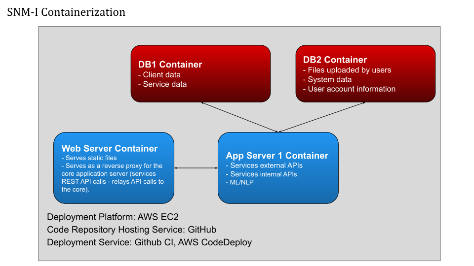
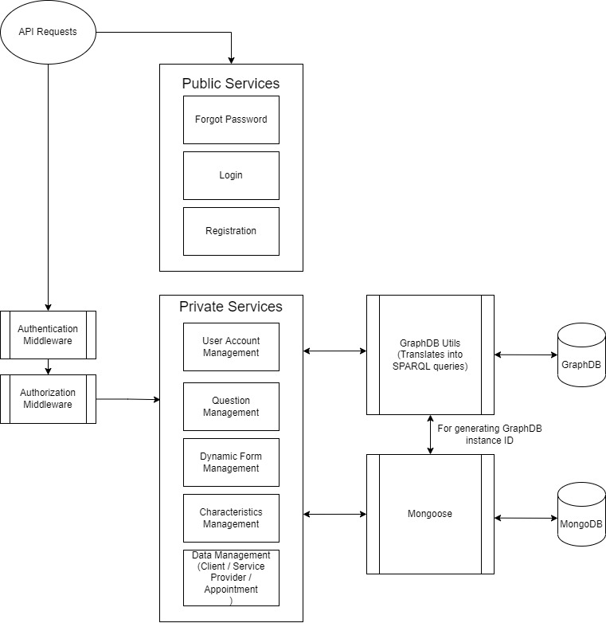

import FileTree from '../../components/file-tree.astro';

The project consists of a website as the frontend and a server with databases as the backend.
The frontend code contains the routing of the pages and the layout of each page,
but the actual content such as the list of users, services,
and **the options of the dropdown menus and forms are dynamically loaded from the backend**
using [our internal APIs](/guides/api/).

## Architecture
The frontend contains the code that calls the APIs to create/read/update/delete these data,
and the backend contains the routing of these APIs and their handlers.
Here is an illustration of the overall architecture:

Zooming in on the backend, we have the following architecture:

As the backend receives an API request sent from the frontend,
if the corresponding hanlder routed to the API is one of the public services,
the server runs the handler, which may query MongoDB, and sends a respond back to the frontend.
Otherwise, it is a private function and the server attempts to authenticates
and authorizes the user before proceeding.
Only after authorizing the user does the server run the dedicated handler,
which then queries the data storage systems.

## File tree
This section contains a summary of what each directory is for to help you
navigate and search for the relevant files.

### Frontend
<FileTree>
- frontend/src/
    - App.js the top React component
    - index.js main entry of the React app
    - routes.js react routers (contains paths to all of the subpages in the website)
    - api/  methods to make API calls to the backend
    - **components/** **contains the bulk of components that render all subpages**
        - shared/ frequently reused components such as alert dialogs and link buttons
    - constants/ frequently reused objects for field population and message strings for blur
    - context/ defines the context object and its getter that tracks the global state
    - helpers/ functions to verify correctness of fields; defines verification error messages and regex to check correctness of entries
    - store/
        - actions/ no longer used as we use React hooks and not Redux
        - reducers/ no longer used as we use React hooks and not Redux
        - reducers.js no longer used as we use React hooks and not Redux
        - defaults.js config for the backend address
    - styles/ css for client and provider tables
</FileTree>

### Backend
<FileTree>
- backend/
    - app.js the main function of the backend (loads the express app)
    - bin/
        - www the starting script for the backend
    - config/
        - index.js contains host/port configs for graphdb, mongodb, and frontend
        - cert.pem required for hosting the http server
        - key.pem required for hosting the http server
    - loaders/ contains the express, graphdb, and mongodb functions called on startup
    - models/ defines the graphdb and mongodb data models
    - routes/ defines the api routes and binds them to corresponding function in services/
    - **services/** **core logic of the backend**
    - utils/ contains the abstract grpahdb model which defines methods that sends queries to the db
</FileTree>
